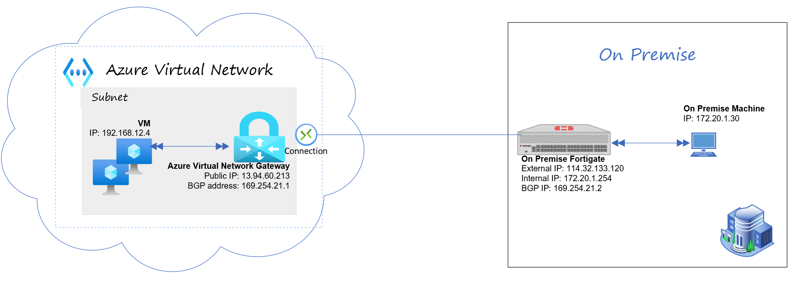
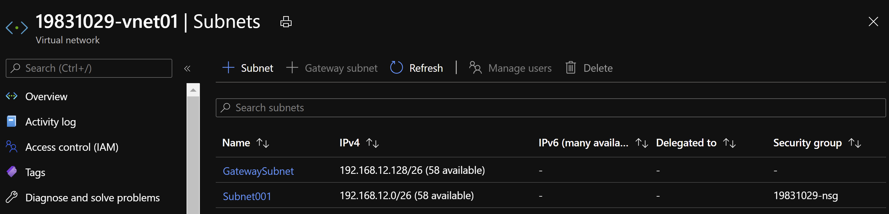
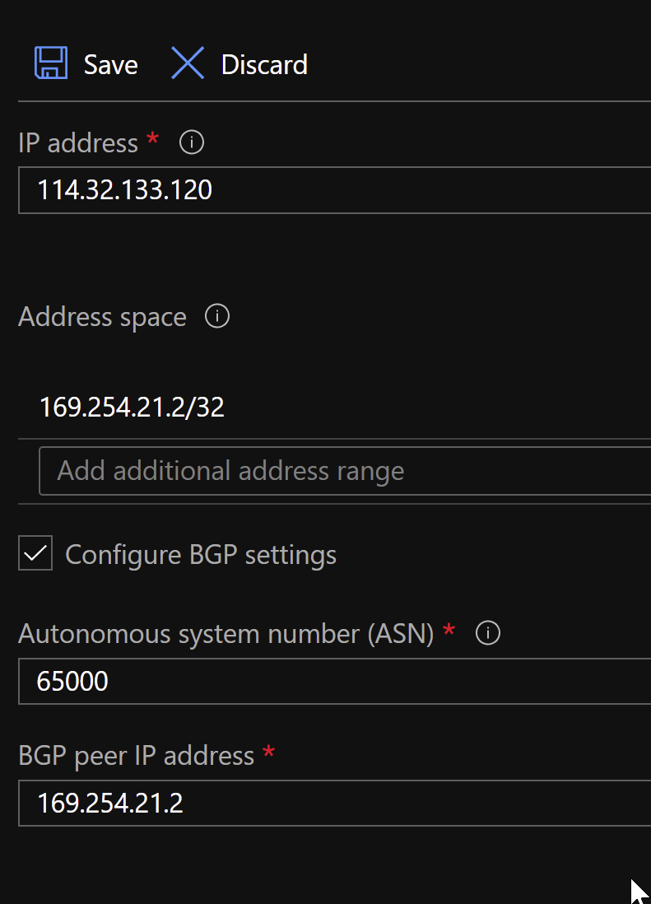
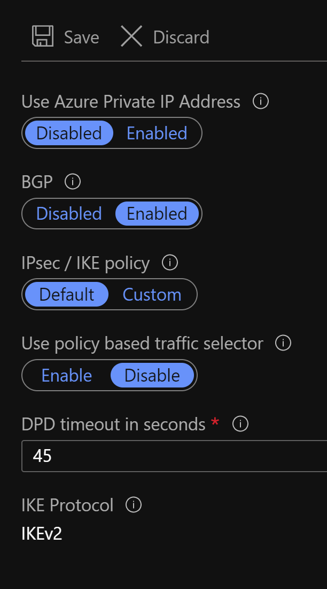
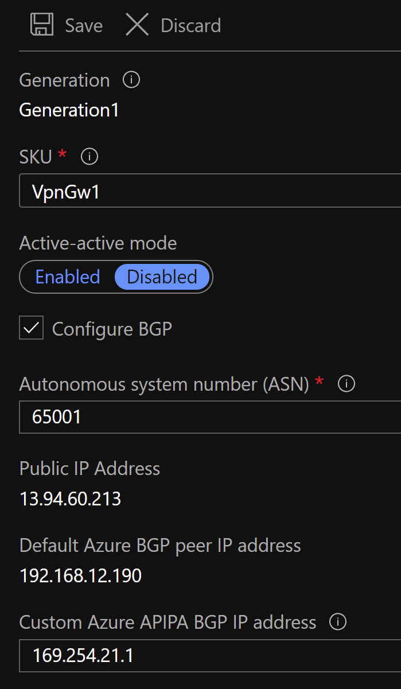
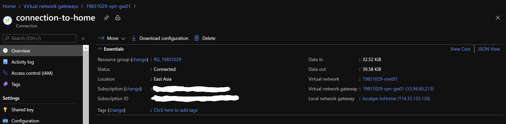
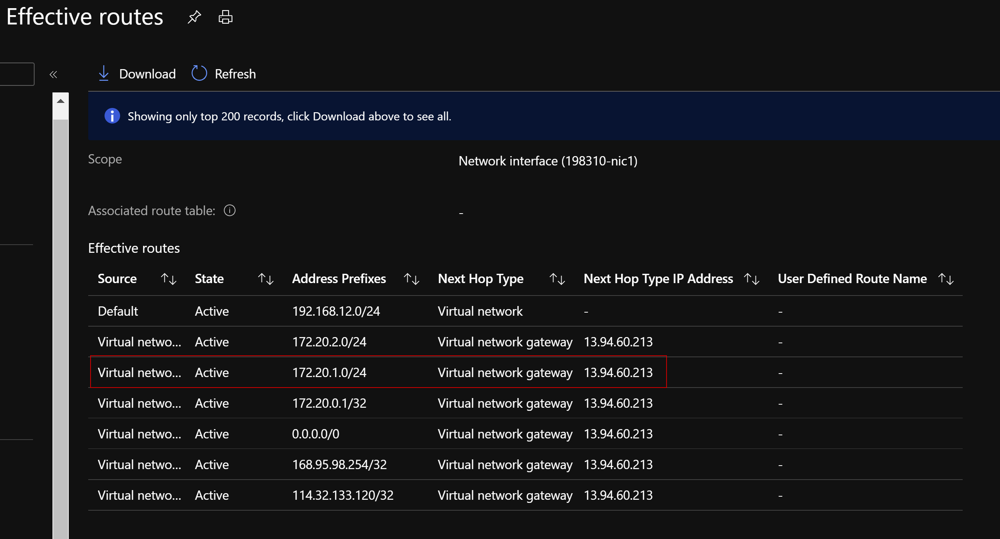

# Connecting-an-Azure-VNet-VPN-to-a-local-FortiGate-with-APIPA-address-as-the-BGP-peer-IP


## Introduction

The main goal of this article is to help people who is going to configure VPN between Azure VPN Gateway and On-Prem Fortigate Firewall and enable the BGP routing protocol with APIPA address as the BGP peer IP.

>**Note:** This guide assumes you have basic understanding of Azure VPN and Fortigate hands on experience.

## Topology

The following demonstrates the topology for this configuration:



## Configure Virtual Network

In the Azure portal, go to Virtual Networks, select the Resource group, desired Name and Region, configure the IP addres space and Subnets for Virtual Machine and Virtual Network Gateway Subnet. Here is the example of result.


If you are not familar with the Virtual Network creation, see how to create a Virtual Network using the Azure Portal: [Link](https://docs.microsoft.com/en-us/azure/virtual-network/quick-create-portal)

## Configure Azure Virtual Machine

We create a VM to demostrate as a VPN endpoint in Azure.
  - Create a VM in the desired Subnet, it would be "Subnet001" in my example. Check [Here](https://docs.microsoft.com/en-us/azure/virtual-network/quick-create-portal) if you are not familar with the Azure VM creation.
  - Check VM NSG to make sure the data traffic is not being blocked.

## Configure Azure VPN Gateway/Virtual Network Gateway

A VPN gateway is a specific type of virtual network gateway that is used to send encrypted traffic between an Azure virtual network and an on-premises location over the public Internet. You can also use a VPN gateway to send encrypted traffic between Azure virtual networks over the Microsoft network. Each virtual network can have only one VPN gateway. However, you can create multiple connections to the same VPN gateway. When you create multiple connections to the same VPN gateway, all VPN tunnels share the available gateway bandwidth.

>**Note:** Click [Here](https://docs.microsoft.com/en-us/azure/vpn-gateway/vpn-gateway-about-vpngateways) to check more information about the Azure VPN Gateway/Virtual Network Gateway including Design, SKUs, AZs and Pricing.

<BR>
To configure the Azure VPN Gateway/Virtual Network Gateway, you need to configure the following components:

  - Azure Local Network Gateway
  - Azure Connections
  - Azure Virtual Network Gateway

>**Note:** Please check [Here](https://docs.microsoft.com/en-us/azure/vpn-gateway/tutorial-site-to-site-portal) if you are not familar with Azure VPN Gateway Creation. 


Here, I am going to provide my examples.

1. Azure Local Network Gateway<div align=left></div>

 2. Azure Connection<div align=left></div>

3. Azure Virtual Network Gateway<div align=left></div>

## Configure Fortigate Fortinet Firewall

On the on-premise FortiGate, you must configure the phase-1 and phase-2 interfaces, firewall policy, and routing to complete the VPN connection. For Azure requirements for various VPN parameters, see [Configure your VPN device](https://docs.microsoft.com/en-us/azure/vpn-gateway/tutorial-site-to-site-portal#VPNDevice).

### Configure Fortigate Interface
```sh
config system interface
    edit "external"
        set vdom "root"
        set ip 114.32.133.120 255.255.255.0
        set allowaccess ping https ssh
        set type physical
        set role wan
        set snmp-index 2
    next
    edit "internal"
        set vdom "root"
        set ip 172.20.1.254 255.255.255.0
        set allowaccess ping https ssh http
        set type hard-switch
        set stp enable
        set role lan
        set snmp-index 6
    next
   edit "loopback0"
        set vdom "root"
        set ip 169.254.21.2 255.255.255.255
        set allowaccess ping
        set type loopback
        set role lan
        set snmp-index 14
     next
end
```

### Configure Internet Default Route
```sh
config router static
    edit 1
        set dst 0.0.0.0 0.0.0.0
        set gateway 114.32.133.254
    next
end
```

### Configure VPN IPSec Phase1-Interface
```sh
config vpn ipsec phase1-interface
    edit "toAzure"
        set interface "external"
        set ike-version 2
        set keylife 28800
        set peertype any
        set proposal aes128-sha256 aes256-sha256 aes128gcm-prfsha256 aes256gcm-prfsha384 chacha20poly1305-prfsha256
        set dpd on-idle
        set dhgrp 2
        set nattraversal disable
        set remote-gw 13.94.60.213
        set psksecret ENC xxxxxxxxxxxxxx
    next
end
```

### Configure VPN IPSec Phase2-Interface
```sh
config vpn ipsec phase2-interface
    edit "toAzure"
        set phase1name "toAzure"
        set proposal aes256-sha1 3des-sha1 aes256-sha512
        set pfs disable
        set replay disable
        set keylifeseconds 27000
    next
end
```

### Configure Firewall Policy for VPN Connectivity
```sh
    edit 21
        set name "toAzure"
        set uuid eb26822e-5128-51ea-0559-bbf1b14cf8e5
        set srcintf "internal"
        set dstintf "toAzure"
        set srcaddr "all"
        set dstaddr "all"
        set action accept
        set schedule "always"
        set service "ALL"
        set logtraffic all
        set fsso disable
        set tcp-mss-sender 1350
        set tcp-mss-receiver 1350
    next
    edit 22
        set name "fromAzure"
        set uuid 1964d8f2-5129-51ea-82e8-17a7dca4fbe4
        set srcintf "toAzure"
        set dstintf "internal"
        set srcaddr "all"
        set dstaddr "all"
        set action accept
        set schedule "always"
        set service "ALL"
        set logtraffic all
        set fsso disable
        set tcp-mss-sender 1350
        set tcp-mss-receiver 1350
    next
end
```

### Configure BGP
```sh
config router bgp
    set as 65000
    set router-id 172.20.0.1
    set ebgp-multipath enable
    config neighbor
        edit "169.254.21.1"
            set ebgp-enforce-multihop enable
            set soft-reconfiguration enable
            set remote-as 65001
            set update-source "loopback0"
        next
    end
    config network
        edit 1
            set prefix 172.20.1.0 255.255.255.0
        next
        edit 2
            set prefix 172.20.2.0 255.255.255.0
        next
        edit 3
            set prefix 172.20.0.0 255.255.255.0
        next
    end
        config redistribute "connected"
        set status enable
    end
    config redistribute "rip"
    end
    config redistribute "ospf"
    end
    config redistribute "static"
        set status enable
        set route-map "allow_default_only"
    end
    config redistribute "isis"
    end
    config redistribute6 "connected"
    end
    config redistribute6 "rip"
    end
    config redistribute6 "ospf"
    end
    config redistribute6 "static"
    end
    config redistribute6 "isis"
    end
end
```

### Configure firewall policy for BGP connectivity
```sh
configure firewall policy
    edit 32
        set name "bgpAzure"
        set uuid 9816f7b2-24bd-51eb-9da8-675fded386ee
        set srcintf "toAzure"
        set dstintf "loopback0"
        set srcaddr "all"
        set dstaddr "all"
        set action accept
        set schedule "always"
        set service "ALL"
        set logtraffic all
        set fsso disable
    next
    edit 24
        set name "bgpoutAzure"
        set uuid 74d2f770-5195-51ea-e6f0-ede94f58bed4
        set srcintf "loopback0"
        set dstintf "toAzure"
        set srcaddr "all"
        set dstaddr "all"
        set action accept
        set schedule "always"
        set service "ALL"
        set logtraffic all
        set fsso disable
    next
end
```

### Configure static route for remote BGP peer IP
```sh
config router static
    edit 10
        set dst 169.254.21.1 255.255.255.255
        set device "toAzure"
    next
end
```

## Verify the VPN Connectivity

### Verify the VPN connectivity from the Azure

We can verify the VPN connectivty state through the Azure Connection portal. The example in below shows the Status = Connected.

<div align=left></div>

We can check NIC effectvie routes on the backend VMs to verify the remote Subnet is being advertised from the BGP.
<div align=left></div>

>**Note:** Check more Azure Monitoring and Alerts for VPN Gateway on [here](https://docs.microsoft.com/en-us/azure/vpn-gateway/vpn-gateway-howto-view-virtual-network-gateway-metrics)

>**Note:** Click [Here](https://docs.microsoft.com/en-us/azure/vpn-gateway/vpn-gateway-troubleshoot-site-to-site-cannot-connect) if you need to troubleshoot the Azure site-to-site VPN Connection.

### Verify the VPN Connectivity from the Fortigate

#### Check IPSec VPN phase1 and 2 Status
```sh
FGT# diagnose vpn ike gateway list 
 
        vd: root/0
        name: toAzure
        version: 2
        interface: ppp1 48
        addr: 114.32.133.120:500 -> 13.94.60.213:500
        created: 4631s ago
        IKE SA: created 1/2  ==established== 1/1  time 30/30/30 ms
        IPsec SA: created 1/2  ==established== 1/1  time 0/0/0 ms
        
        id/spi: 1417126 e7a201920b0e52f8/12a8a275ec0e16a1
        direction: responder
        status: established 4613-4612s ago = 30ms
        proposal: aes128-sha256
        child: no
        SK_ei: 07d9d8498ee329d1-98a6a5e2932449e4
        SK_er: 583f5e75bd1b05fb-43314aa4e60f5664
        SK_ai: 971118f7ec233a68-e1499e143ad05708-add96d94a297bb17-accc33dd4d62f603
        SK_ar: 319c46fbda39171b-6e5f4a339634d175-1cc2e0ca6e674084-9322e2860ef88c1f
        PPK: no
        message-id sent/recv: 31/61
        lifetime/rekey: 28800/23917
        DPD sent/recv: 0007ac00/0007ac00
```

#### Check BGP peer state
```sh
FGT# get router info bgp summary 
        BGP router identifier 172.20.0.1, local AS number 65000
        BGP table version is 10
        2 BGP AS-PATH entries
        0 BGP community entries
        
        Neighbor        V         AS MsgRcvd MsgSent   TblVer  InQ OutQ Up/Down  State/PfxRcd
        169.254.21.1    4      65001    1787    1798        9    0    0 01:09:43        1     
        
        Total number of neighbors 1
```

#### Check routing table BGP
```sh
FGT# get router info routing-table bgp
 
        Routing table for VRF=0
        B       192.168.12.0/24 [20/0] via 169.254.21.1 (recursive is directly connected, toAzure), 01:09:57
```

#### Example of debug IPSec VPN Tunnel
```sh
FGT# diagnose debug enable
FGT# diagnose debug application ike -1
    Debug messages will be on for 30 minutes.
FGT# ike 0: cache rebuild start
    ike 0:toAzure: cached as static-ddns
    ike 0: cache rebuild done
    ike shrank heap by 106496 bytes
    ike 0:toAzure: NAT keep-alive 3 10.0.0.15->94.245.93.197:4500.
    ike 0:toAzure:125: out FF
    ike 0:toAzure:125: sent IKE msg (keepalive): 10.0.0.15:4500->94.245.93.197:4500, len=1, id=ff00000000000000/0000000000000000
    ike 0:toAzure:azurephase2: IPsec SA connect 3 10.0.0.15->94.245.93.197:4500
    ike 0:toAzure:azurephase2: using existing connection
    ike 0:toAzure:azurephase2: config found
    ike 0:toAzure:azurephase2: IPsec SA connect 3 10.0.0.15->94.245.93.197:4500 negotiating
```